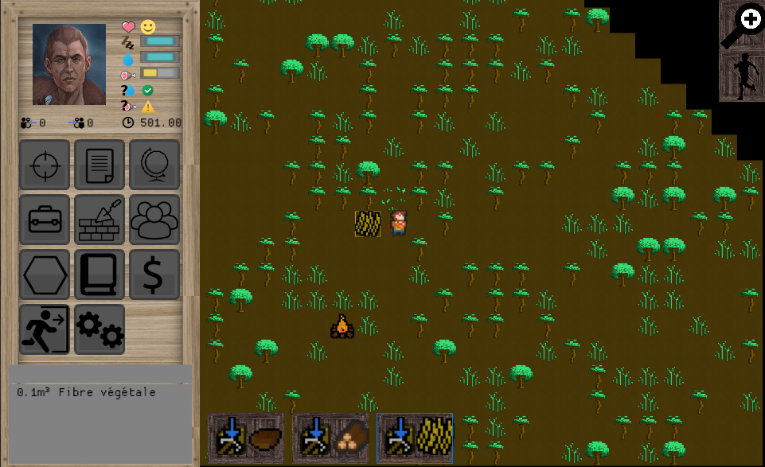

# Rolling

[](https://github.com/buxx/rolling/actions/workflows/tests.yml)

Server side of [rolling](https://rolling.bux.fr) game. See [rollgui2](https://github.com/buxx/rollgui2) for client side.



To see information about how to play, please visit [this page](https://buxx.github.io/rolling/pages/)

# Installation

A python3.10+ is required.

Following documentation assume you use debian 10 or similar OS. Additionally to Python3.10, you will need:

    apt-get install git build-essential python3-dev postgresql postgresql-server-dev-11

## Python environment require

If you need to create a virtual environment, you can use the following:

    python3 -m venv venv

Then activate it in current terminal with:

    source venv/bin/activate

To install required python packages:

    pip install --upgrade pip setuptools wheel
    pip install -r requirements.txt
    python setup.py develop

Then install dev packages:

    pip install -e ".[dev]"

## Generate a map

Need [Rust](https://www.rust-lang.org/learn/get-started)

Write a text file (ex. myworldmap.txt) containg, for example:

```
::LEGEND
~ SEA*
^ MOUNTAIN
ፆ JUNGLE
∩ HILL
⡩ BEACH
⠃ PLAIN
::META
SPAWN:RANDOM:BEACH,
::GEO
~~~~~~~~~~~~~~~~~~~~~~~~~
~~~~~~~~~~~~~~~~~~~~~~~~~
~~~~~~~~~ፆ^ፆፆ~~~~~~~~~~~~
~~~~~~~~ፆ^^^∩ፆ~~~~~~~~~~~
~~~~~~~⡩ፆ∩∩∩∩⡩~~~~~~~~~~~
~~~~~~⡩ፆፆ∩∩∩ፆፆ⡩~~~~~~~~~~
~~~~~~⡩ፆፆፆፆፆፆፆ⡩~~~~~~~~~~
~~~~~~⡩⠃⠃⠃ፆፆፆፆ⡩~~~~~~~~~~
~~~~~~⡩⠃⠃⠃⠃⠃⠃⡩~~~~~~~~~~~
~~~~~~~⡩⠃⠃⠃⠃⡩~~~~~~~~~~~~
~~~~~~~~⡩⡩⡩⡩~~~~~~~~~~~~~
~~~~~~~~~~~~~~~~~~~~~~~~~
~~~~~~~~~~~~~~~~~~~~~~~~~
```

Then, generate zones maps:

    cargo run myworldmap.txt --height 64 --width 64 --output-dir myzones

## Start server

You need a server config file: Copy template with:

    cp server.ini.tpl server.ini

Then modify content with your configuration. Note: SMTP is only required for forgotten password.

    rolling-server --host 127.0.0.1 --port 5002 --debug ./myworldmap.txt ./myzones ./game ./server.ini

Where `./myworldmap.txt` is previously created world map text file, `./myzones` previously generated zones folder and `./game` the config folder (you can use [repository folder](https://github.com/buxx/rolling/tree/master/game) or copied and modified one).

## Use docker image

To build docker image:

    docker build . -t rolling:latest

To run server:

    docker run -v <local path containing world.txt>:/world -v <local path containing zones>:/zones -v <local path containing game config>:/game -v -v <local path for db>:/db rolling:latest

## Reload configuration without stop server

    kill -SIGHUP <pid>

Look at server logs to ensure everything is ok. If config produce error at load, config is not replaced.

# Roadmap (fr)

See here : [https://github.com/users/buxx/projects/4/views/1](https://github.com/users/buxx/projects/4/views/1)
