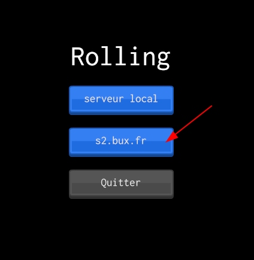
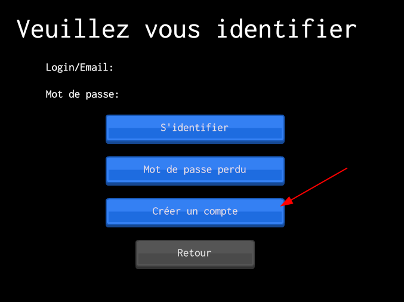
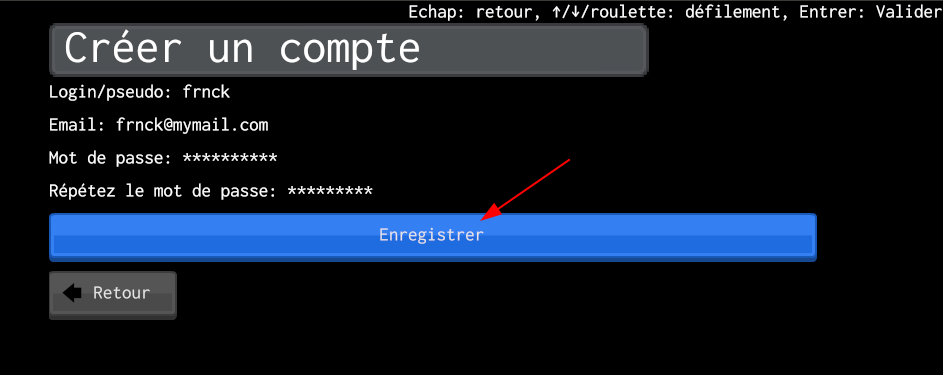
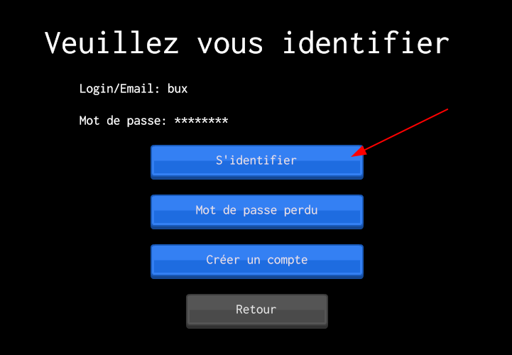
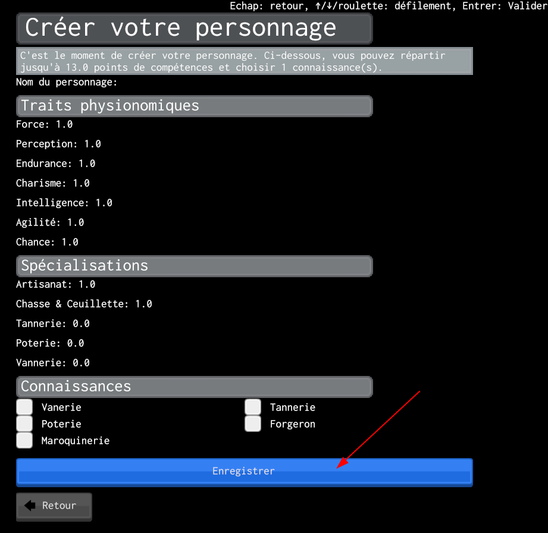

## Se créer un compte

Choisissez le serveur sur lequel vous voulez jouer, par exemple, `s2.bux.fr` (ne sélectionnez `Serveur local` que si vous avez déployé un serveur vous-même sur votre ordinateur).

Cliquez sur "Créer un compte".

Entrez vos informations (l'email vous sera utile en cas de perte de mot de passe).

Une fois cela fait, identifiez-vous avec l'identifiant et le mot de passe que vous avez choisis.

Vous pourrez alors créer votre personnage.

