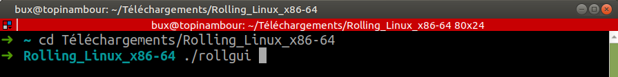
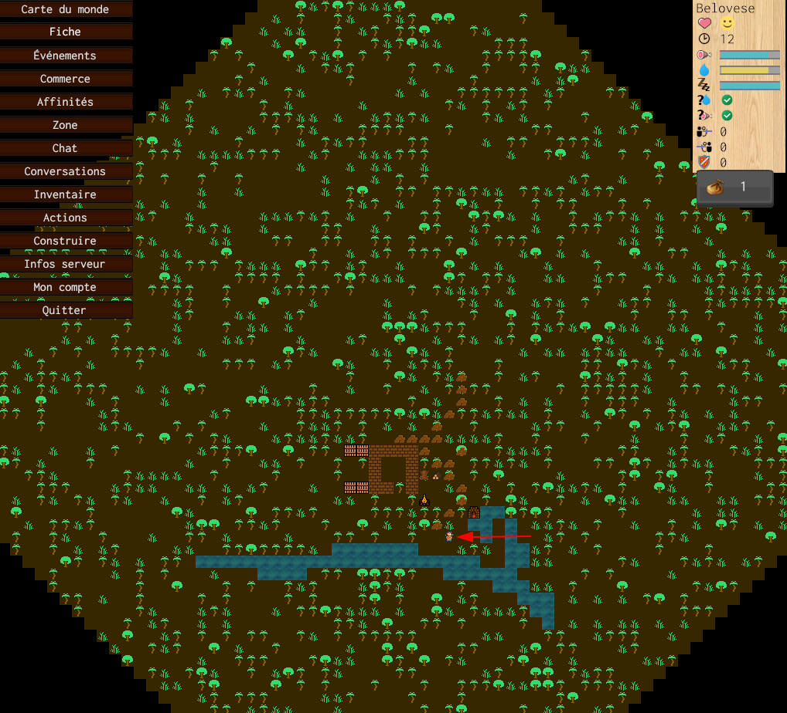

# Jouer à Rolling

**Rolling est en cours de développement** ! Toutes vos remarques seront utiles et permettrons de développer le jeu !

* [Discuter sur Discord](https://discord.gg/Xs9cDjq)
* [Discuter par email](https://framalistes.org/sympa/subscribe/rolling)
* [Déclarer un bug sur github.com](https://github.com/buxx/rolling/issues/new)

## Installation

1: Téléchargez le jeu (fichier `.zip`):

* Windows : [télécharger](https://tracim.bux.fr/ui/guest-download/737b35b3-d3dc-477c-99ee-d25fdaa09f26)
* Linux : [télécharger](https://tracim.bux.fr/ui/guest-download/81c83092-32c9-4df8-a5db-61dd69c6659c)

2: [Décompressez](https://support.microsoft.com/fr-fr/windows/compresser-et-d%C3%A9compresser-des-fichiers-f6dde0a7-0fec-8294-e1d3-703ed85e7ebc) l'archive téléchargée, par exemple dans votre dossier "Téléchargements"

## Lancer le jeu

### Avec Windows

Ouvrez le dossier que vous avez décompréssé depuis l'archive `.zip` et double cliquez sur `RiseOfClans.exe` (ou `rollgui.bat` si vous voulez visualiser des informations techniques pour les indiquer au développeur en cas d'erreur).

### Avec Gnu/Linux

Ouvrez un terminal et déplacez-vous dans le dossier décompréssé. Puis éxécutez le fichier `RiseOfClans`:

## Se créer un compte

Consultez [cette page](create_account.md) pour plus d'informations.

## L'interface du jeu

Votre personnage se trouve sur l'écran. Il est indiqué ici par la flèche rouge. Désormais, vous devez survivre !

A savoir:

* `← ↑ → ↓` : Déplacer votre personnage (ou en cliquant sur la carte)
* `MAJ + ← ↑ → ↓` : Déplacer votre personnage rapidement
* `Enter` : Ouvrir le chat

En haut à droite, le panneau résume la situation de votre personnage:

* Son nom
* Sa santé
* Le nombre de points d'actions restant
* Sa faim
* Sa soif
* Sa fatigue
* Si il a de l'eau à sa disposition
* Si il a de la nourriture à sa disposition
* Combien de personnages le suive
* Combien de personnages il suit
* Combien de personnages vous protèges

Le menu de gauche permet d'effectuer les actions du jeu:

* Carte du monde : permet de savoir ou vous vous trouver dans le monde
* Fiche : Fiche d'informations sur votre personnage
* Événements : Ce qui est arrivé à votre personnage
* Commerce : Proposer ou effectuer des échanges commerciaux
* Affinités : Créer ou rejoindre des groupes de personnages
* Zone : Informations sur l'endroit où vous vous trouvez
* Chat : Chat de la zone
* Conversations : Discussions avec d'autres personnages
* Inventaire : Consulter et utiliser ce que votre personnage possède
* Actions : Faire faire des actions à votre personnage
* Construire : Construire des bâtiments, murs, etc
* Infos serveur : Ouvre une page d'information (dans un navigateur web) sur le serveur
* Mon compte : Ouvre une page (dans un navigateur web) pour gérer votre compte
* Quitter : Pour quitter (mais restez encore un peu !)
